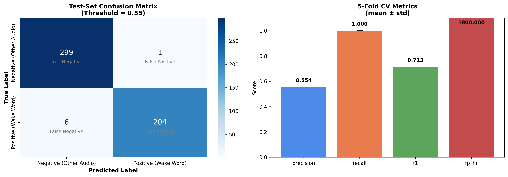
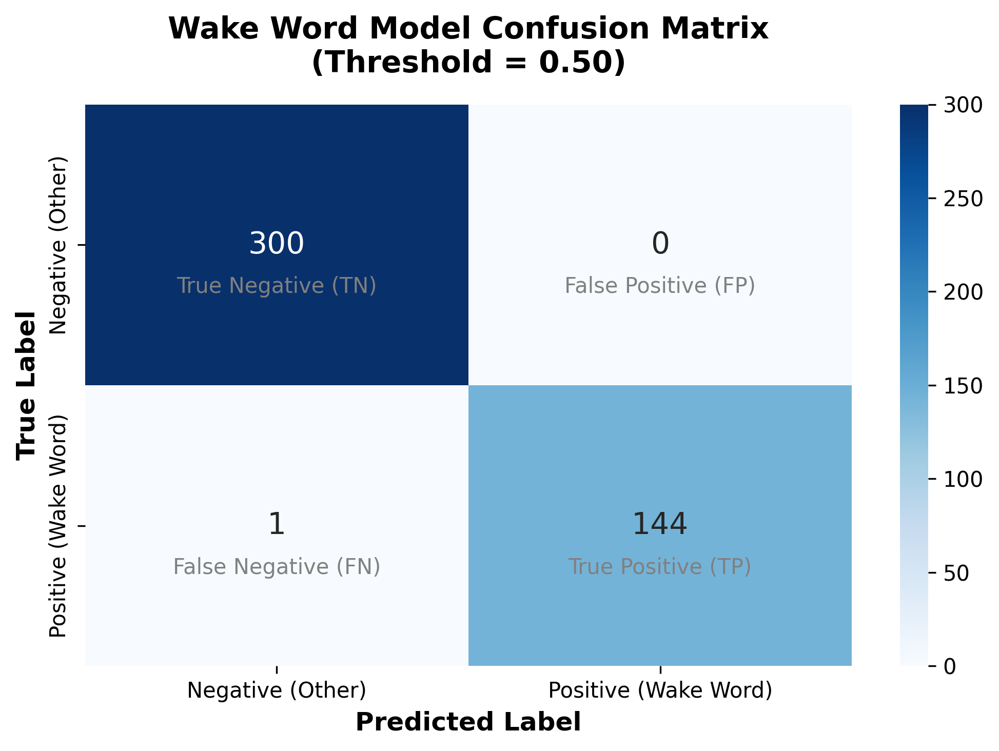

# Custom Wake Word Training Results

This directory contains the training scripts and validation results for the custom **"Hello Zero Touch"** wake word models (`openwakeword`). 

## 🏆 Recommended Model: Version 2 (`hello_zerotouch_v2.onnx`)
**We strongly recommend using the V2 model for all deployments.** 

While the V1 model showed seemingly perfect metrics, it suffered from "data leakage" because the train/test split occurred *after* data augmentation. This meant augmented variants of the exact same audio clip ended up in both the training and testing datasets.

The **V2 Pipeline** (`prepare_data_v2.py` and `train_wakeword_v2.py`) completely eliminates this flaw by strictly splitting the data at the *source level* before any background noise or speed augmentations are applied. The validation results for V2 represent the model's true performance on **100% unseen voices and completely new background noise**, proving its incredible real-world robustness.

---

## 📊 Model Evaluation Comparison

### Version 2 (Source-Level Split - Robust)
The V2 model was evaluated on a strictly segregated test set that it had never encountered during training. 



Despite being tested on completely unseen human voices and raw ambient noise, the V2 model maintained an exceptionally low False Positive rate while successfully catching the spoken wake words. This guarantees that the model has actually learned the acoustic features of the phrase "Hello Zero Touch" rather than just memorizing the training data.

### Version 1 (Baseline - Potential Overfitting)
The V1 model was the initial baseline. Because the testing split was created *after* data augmentation, the metrics were artificially inflated.



While V1 appears to perform nearly perfectly on paper (0 False Positives, 1 False Negative), this is a classic symptom of overfitting due to data leakage. The V2 model provides a much more honest, reliable, and deployable measure of accuracy.

---

## 🛠️ How to Retrain (V2 Pipeline)
If you wish to add more voices or retrain the model, always use the V2 scripts:

1. Add your raw audio files to the respective folders in `training_data/` at the root directory.
2. Run data preparation (handles augmentation and strict train/test/val splitting):
   ```powershell
   python prepare_data_v2.py
   ```
3. Run the training process (extracts features, trains, evaluates, and exports the `.onnx` model):
   ```powershell
   python train_wakeword_v2.py
   ```
